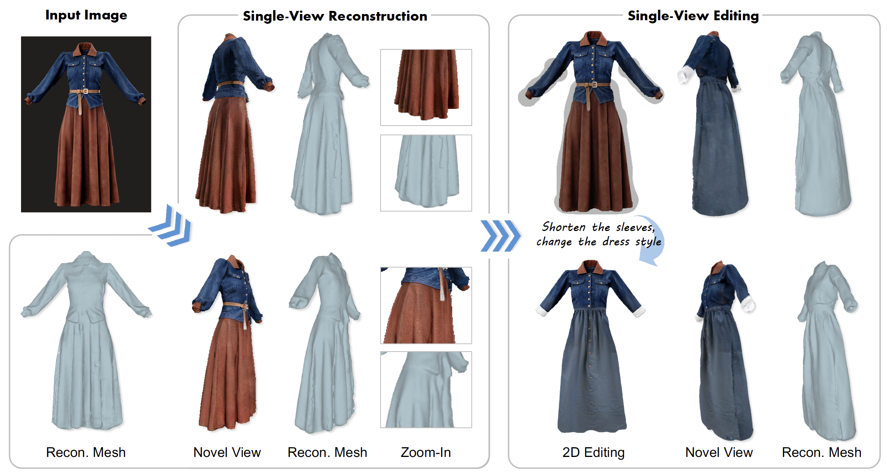
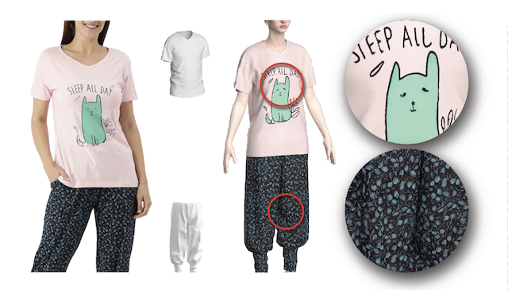

<h2 id="publications" style="margin: 2px 0px -15px;">Publications</h2>

<ol class="bibliography">

<li>

  

    
    <abbr class="badge">Under Review</abbr>
  

  

    

    GarmentCrafter: Progressive Novel View Synthesis for Single-View 3D Garment Reconstruction and Editing
    <!-- <a href="https://humansensinglab.github.io/fabric-diffusion/">FabricDiffusion: High-Fidelity Texture Transfer for 3D Garments Generation from In-The-Wild Images</a> -->
    

    
<strong>Yuanhao Wang</strong>, Cheng Zhang, Goncalo Frazao, Jinlong Yang, Alexandru-Eugen Ichim, Thabo Beeler, Fernando De la Torre

    
<em>Under Review</em>

    

      <!-- <a href="https://humansensinglab.github.io/fabric-diffusion/" class="btn btn-sm z-depth-0" role="button" target="_blank" style="font-size:12px;">Project</a> -->
      <!-- <a href="https://arxiv.org/abs/2410.01801" class="btn btn-sm z-depth-0" role="button" target="_blank" style="font-size:12px;">Paper</a> -->
      <!-- <a href="https://github.com/brownvc/Slant-CNN-Biases" class="btn btn-sm z-depth-0" role="button" target="_blank" style="font-size:12px;"> -->
      <!-- Code -->
      <!-- </a> -->
      <!-- <a href="https://www.youtube.com/watch?v=xYiyjwldtWc" class="btn btn-sm z-depth-0" role="button" target="_blank" style="font-size:12px;">Video</a> -->
    

  

</li>

<li>

  

    
    <abbr class="badge">SIGGRAPH Asia</abbr>
  

  

    
<a href="https://humansensinglab.github.io/fabric-diffusion/">FabricDiffusion: High-Fidelity Texture Transfer for 3D Garments Generation from In-The-Wild Images</a>

    
Cheng Zhang*, <strong>Yuanhao Wang*</strong>, Francisco Vicente, Chenglei Wu, Jinlong Yang, Thabo Beeler, Fernando De la Torre

    
<em>ACM SIGGRAPH Asia, 2024</em>

    

      <a href="https://humansensinglab.github.io/fabric-diffusion/" class="btn btn-sm z-depth-0" role="button" target="_blank" style="font-size:12px;">Project</a>
      <a href="https://arxiv.org/abs/2410.01801" class="btn btn-sm z-depth-0" role="button" target="_blank" style="font-size:12px;">Paper</a>
      <a href="https://github.com/humansensinglab/fabric-diffusion" class="btn btn-sm z-depth-0" role="button" target="_blank" style="font-size:12px;">Code</a>
      <a href="https://www.youtube.com/watch?v=xYiyjwldtWc" class="btn btn-sm z-depth-0" role="button" target="_blank" style="font-size:12px;">Video</a>
    

  

</li>

<li>

  

    
    <abbr class="badge">TAP</abbr>
  

  

    
<a href="https://dl.acm.org/doi/abs/10.1145/3613451">On Human-like Biases in Convolutional Neural Networks for the Perception of Slant from Texture</a>

    
<strong>Yuanhao Wang</strong>, Qian Zhang, Celine Aubuchon, Jovan Kemp, Fulvio Domini, James Tompkin

    
<em>ACM Transactions on Applied Perception <strong>(TAP)</strong>, 2023.</em>

    

      <a href="https://dl.acm.org/doi/full/10.1145/3613451" class="btn btn-sm z-depth-0" role="button" target="_blank" style="font-size:12px;">Paper</a>
      <a href="https://github.com/brownvc/Slant-CNN-Biases" class="btn btn-sm z-depth-0" role="button" target="_blank" style="font-size:12px;">Code</a>
      <a href="https://shorturl.at/frvKU" class="btn btn-sm z-depth-0" role="button" target="_blank" style="font-size:12px;">Slides</a>
      <strong><i style="color:#e74d3c">Oral Presentation</i></strong>
    

  

</li>
  
 

</ol>

