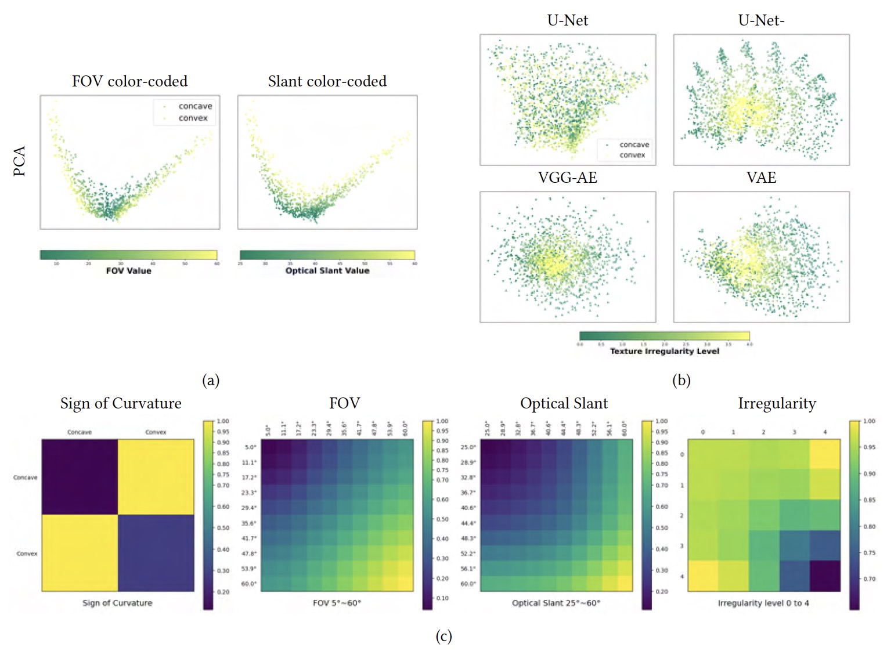

<h2 id="publications" style="margin: 2px 0px -15px;">Publications</h2>

<ol class="bibliography">

<li>

  

    
    <abbr class="badge">TAP</abbr>
  

  

    
<a href="https://dl.acm.org/doi/abs/10.1145/3613451">On Human-like Biases in Convolutional Neural Networks for the Perception of Slant from Texture</a>

    
<strong>Yuanhao Wang</strong>, Qian Zhang, Celine Aubuchon, Jovan Kemp, Fulvio Domini, James Tompkin

    
<em>ACM Transactions on Applied Perception <strong>(TAP)</strong>, 2023.</em>

    

      <a href="https://dl.acm.org/doi/full/10.1145/3613451" class="btn btn-sm z-depth-0" role="button" target="_blank" style="font-size:12px;">Paper</a>
      <a href="https://github.com/brownvc/Slant-CNN-Biases" class="btn btn-sm z-depth-0" role="button" target="_blank" style="font-size:12px;">Code</a>
      <a href="https://shorturl.at/frvKU" class="btn btn-sm z-depth-0" role="button" target="_blank" style="font-size:12px;">Slides</a>
      <strong><i style="color:#e74d3c">Oral Presentation</i></strong>
    

  

</li>
  
 

</ol>

